# Panduan Pengguna Bangunan Abadi - Sync System AOL

Versi 1.0 | 2 Oktober 2026 | Bahasa Indonesia

## Mengenal aplikasi dan persiapan

Bangunan Abadi - Sync System AOL membantu operator mengambil master dan transaksi dari sistem sumber Bangunan Abadi, menyimpannya dalam database aplikasi, lalu mengirim transaksi ke Accurate Online. Aplikasi digunakan melalui browser.

### Siapa yang menggunakan panduan ini?

Operator transaksi, staf administrasi, dan penanggung jawab integrasi. Panduan mencakup aktivitas pengguna sehari-hari; pemasangan server diserahkan kepada administrator teknis.

### Sebelum mulai

- Minta alamat aplikasi, username, dan password akun aktif dari pengelola. URL lokal pada screenshot hanyalah alamat demonstrasi.
- Siapkan akun Accurate yang mempunyai akses ke database perusahaan tujuan.
- Untuk koneksi awal, minta ClientID dan Client Secret integrasi dari pengelola. Jangan menggunakan nilai contoh di gambar.
- Pastikan data sumber, kode pelanggan/pemasok, barang, satuan, gudang, cabang, bank, dan tanggal transaksi sudah benar.

> Screenshot login berasal dari aplikasi lokal. Screenshot halaman setelah login dibuat dari template PHP asli dengan akun, database, transaksi, dan log contoh pada preview terisolasi. Koneksi OAuth serta pengiriman ke Accurate tidak dijalankan untuk membuat dokumen ini.

Dokumen disusun berdasarkan kode aplikasi di workspace pada 2 Oktober 2026. Nama menu dan tombol mengikuti versi tersebut. Data contoh SI-DEMO-001 tidak mewakili transaksi operasional.

## Navigasi dan halaman utama

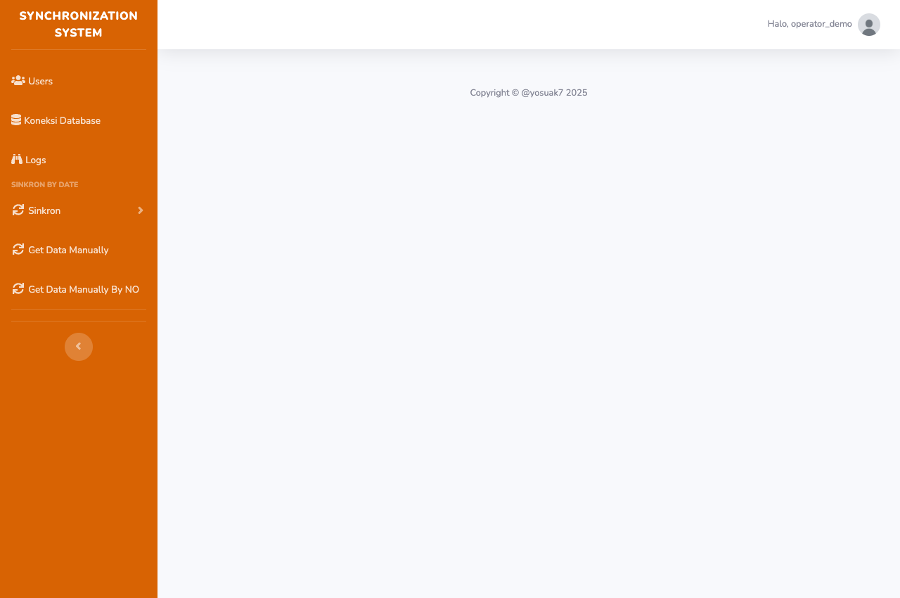

Setelah login, halaman utama menampilkan sidebar dan menu akun. Area tengah dapat kosong: gunakan sidebar untuk memulai pekerjaan.

- Users: daftar pengguna dan tambah akun.
- Koneksi Database: otorisasi Accurate dan pilih database tujuan.
- Logs: hasil pengiriman untuk pengguna yang sedang login.
- Sinkron: klik untuk membuka Transaction Sync By Date dan Transaction Sync By No.
- Get Data Manually / By NO: ambil transaksi sumber.
- Halo, username: klik untuk membuka Profile, Settings, atau Logout. Tombol bulat pada sidebar mengecilkan menu.

## Panduan cepat: pekerjaan pertama

Untuk transaksi baru, lakukan persiapan koneksi, pengambilan data, sinkronisasi, lalu pemeriksaan hasil. Pilih satu hari dan satu jenis transaksi terlebih dahulu.

| Urutan | Tindakan | Hasil yang diharapkan |
| --- | --- | --- |
| 1 | Login memakai akun aktif. | Sidebar dan menu akun tampil. |
| 2 | Settings: isi integrasi lalu Simpan. | Pengaturan pengguna tersimpan. |
| 3 | Koneksi Database: otorisasi, pilih database, Proses. | Koneksi berhasil ke database yang benar. |
| 4 | Get Data Manually: isi rentang, klik Get sesuai jenis. | Ringkasan pengambilan data tampil. |
| 5 | Sinkron > Transaction Sync By Date: periode sama, klik Sync. | Progres dan jumlah hasil tampil. |
| 6 | Logs dan Accurate: periksa nomor serta isi dokumen. | Hasil aplikasi cocok dengan dokumen tujuan. |

### Dua tahap yang berbeda

Get Data mengambil data sumber ke database aplikasi. Sync membaca data yang tersimpan di aplikasi dan mengirimnya ke Accurate. Pesan Get Data berhasil belum membuktikan transaksi sudah masuk Accurate.

> Sebelum klik Sync, pastikan database tujuan dan periode sudah benar. Sejumlah alur mencari transaksi yang sudah ada, menghapusnya, lalu menyimpan ulang. Jangan mengulang seluruh periode tanpa memeriksa dokumen tujuan.

Jika Anda hanya memperbaiki invoice tertentu, gunakan alur berdasarkan nomor pada halaman 13-14. Untuk pembelian dan penjualan lengkap, ikuti urutan pada halaman 15-16.

## Login dan keluar aplikasi

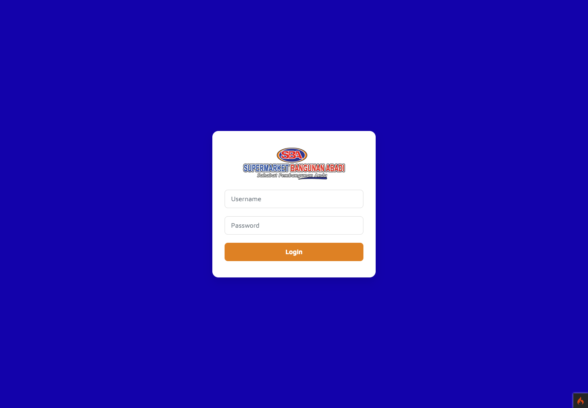

1. Buka alamat aplikasi yang diberikan pengelola.
2. Isi Username dan Password, lalu klik Login.
3. Jika berhasil, Anda masuk ke halaman utama. Jika gagal, periksa ejaan username, password, dan status aktif akun.

### Mengakhiri penggunaan

Klik menu Halo, username, kemudian Logout. Saat login atau sesi Accurate berakhir, Anda mungkin harus masuk dan memilih database lagi.

> Halaman Profile tidak menyediakan fitur lupa password atau pengiriman tautan reset. Jika tidak dapat masuk, hubungi pengelola akun.

## Settings: pengaturan integrasi

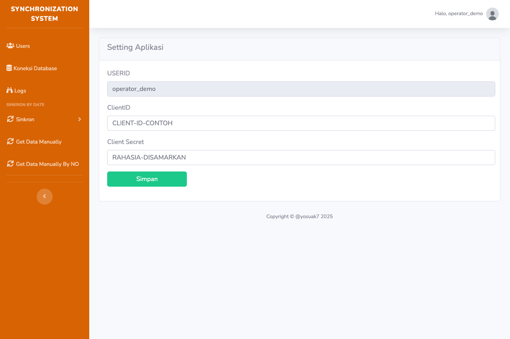

1. Klik menu akun di kanan atas, pilih Settings.
2. Pastikan USERID sesuai akun Anda. Kolom ini tidak diedit.
3. Masukkan ClientID dan Client Secret yang disediakan pengelola integrasi.
4. Klik Simpan, kemudian periksa pesan berhasil.

> Pada versi ini, Client Secret tampil sebagai teks biasa. Jangan membagikan screenshot pengaturan yang berisi kredensial asli.

Pengaturan tersimpan per pengguna. Login menyimpan kredensial ke sesi; setelah mengubah konfigurasi, logout lalu login kembali sebelum mengulangi koneksi agar sesi memakai nilai terbaru.

## Otorisasi dan koneksi database Accurate

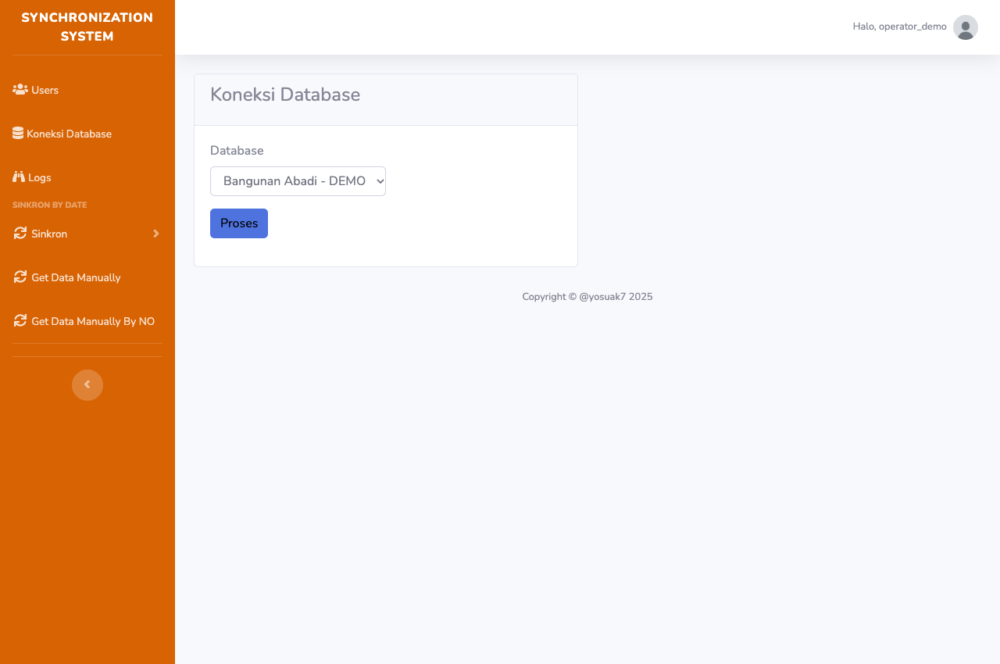

1. Klik Koneksi Database. Jika token belum tersedia, aplikasi mengarahkan Anda ke halaman otorisasi Accurate.
2. Masuk di halaman Accurate menggunakan akun yang berhak atas database perusahaan; ikuti permintaan persetujuan yang ditampilkan.
3. Setelah kembali ke aplikasi, pilih database yang benar pada kolom Database.
4. Klik Proses. Periksa pesan Berhasil Tersambung KeDatabase! sebelum membuka menu transaksi.

> Gambar hanya menunjukkan pemilihan database pada aplikasi. Layar login dan persetujuan eksternal Accurate tidak direkam dalam dokumentasi ini.

Jika muncul Pilih Database Terlebih Dahulu!, kembali ke halaman ini. Jika mengganti perusahaan/cabang tujuan, selesaikan proses pemilihan database baru sebelum menjalankan sinkronisasi berikutnya.

## Get Data Manually: berdasarkan tanggal

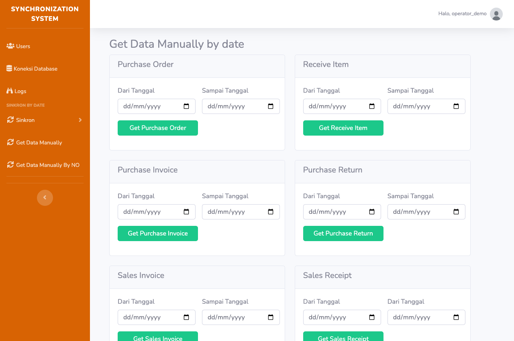

1. Buka Get Data Manually dari sidebar.
2. Pilih panel jenis transaksi. Isi tanggal awal di kolom kiri dan tanggal akhir di kolom kanan.
3. Klik tombol Get yang sesuai, misalnya Get Purchase Order.
4. Tunggu dialog selesai, catat jumlah transaksi berhasil dan gagal.
5. Ulangi hanya untuk jenis transaksi lain yang diperlukan, kemudian lanjutkan ke menu Sinkron dengan periode yang sama.

> Pada halaman ini beberapa kolom kanan juga berlabel "Dari Tanggal". Kolom kanan dipakai sebagai akhir rentang. Isi keduanya, pastikan tanggal awal tidak melewati tanggal akhir.

Mengambil kembali nomor yang sama dapat menghapus detail lokal lama dan mengisi ulang dari sumber. Perubahan data sumber baru ikut terkirim setelah Anda menjalankan Sync lagi.

## Jenis data yang dapat diambil

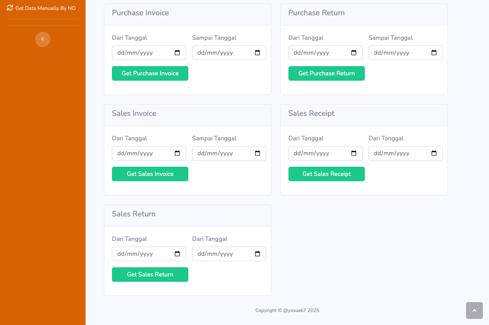

| Panel / tombol | Isi data |
| --- | --- |
| Get Purchase Order | Pesanan pembelian. |
| Get Receive Item | Penerimaan barang. |
| Get Purchase Invoice | Faktur pembelian. |
| Get Purchase Return | Retur pembelian. |
| Get Sales Invoice | Faktur penjualan. |
| Get Sales Receipt | Data pembayaran/penerimaan penjualan. |
| Get Sales Return | Retur penjualan. |

Gulir halaman untuk menemukan panel lain. Ringkasan menghitung transaksi yang diproses; satu transaksi dapat berisi banyak baris barang. Jika berhasil 0 dan gagal 0, periksa periode dan keberadaan data sumber.

> Data tersimpan di database aplikasi. Halaman ini tidak menyediakan tabel pratinjau detail transaksi atau tombol ekspor pengguna.

## Transaction Sync By Date

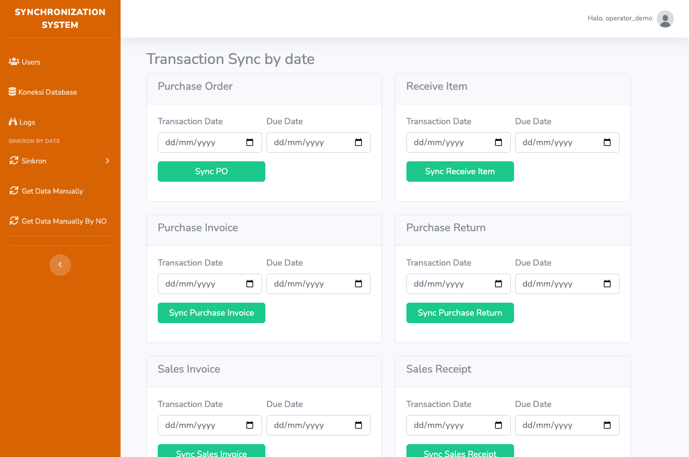

1. Buka Sinkron > Transaction Sync By Date.
2. Pada panel yang diperlukan, isi Transaction Date sebagai awal rentang dan Due Date sebagai akhir rentang.
3. Gunakan periode data yang sebelumnya diambil lewat Get Data.
4. Klik tombol Sync sesuai panel, misalnya Sync PO. Biarkan tab tetap terbuka selama proses.
5. Setelah selesai, periksa jumlah berhasil/gagal, kemudian buka Logs dan verifikasi di Accurate.

> "Due Date" pada layar ini dipakai untuk akhir filter periode, bukan untuk mengubah jatuh tempo dokumen. Pilih awal dan akhir yang mencakup transaksi yang hendak dikirim.

Aplikasi membaca daftar transaksi lokal lalu memprosesnya bergiliran. Jangan klik ulang, mengganti database, atau menutup tab saat dialog progres masih berjalan.

## Sync By Date: panel dan ringkasan

| Tombol | Transaksi tujuan |
| --- | --- |
| Sync PO | Purchase Order |
| Sync Receive Item | Penerimaan barang |
| Sync Purchase Invoice | Faktur pembelian |
| Sync Purchase Return | Retur pembelian |
| Sync Sales Invoice | Faktur penjualan |
| Sync Sales Receipt | Penerimaan penjualan |
| Sync Sales Return | Retur penjualan |

Dialog progres menunjukkan jumlah diproses dari total, berhasil, dan gagal. Dialog akhir dapat menampilkan beberapa pesan kesalahan pertama. Nilai berhasil/gagal dapat menghitung dokumen keluaran, terutama ketika satu invoice mempunyai beberapa pembayaran.

> Tanda selesai hanya berarti proses telah berakhir. Jika gagal lebih dari 0, baca pesannya dan tindak lanjuti transaksi yang belum berhasil.

## Get Data Manually By NO

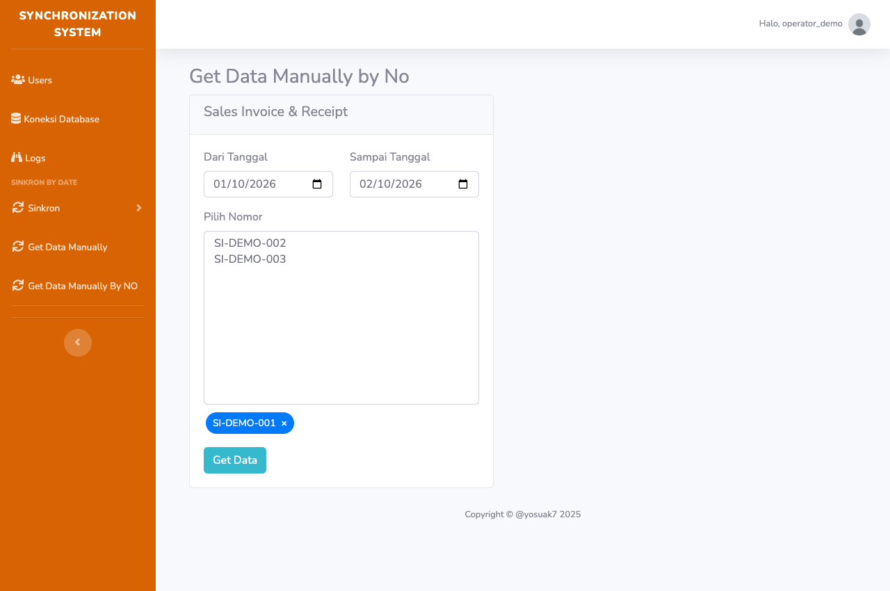

1. Buka Get Data Manually By NO. Panel aktif bernama Sales Invoice & Receipt.
2. Isi Dari Tanggal dan Sampai Tanggal. Daftar nomor dimuat saat kedua tanggal tersedia.
3. Pilih nomor pada Pilih Nomor. Nomor berpindah ke chip di bawah daftar; Anda dapat memilih beberapa nomor.
4. Klik tanda x pada chip untuk membatalkan pilihan yang keliru.
5. Klik Get Data dan periksa ringkasan. Data invoice beserta pembayaran terkait diambil ke aplikasi.

> Fitur pengambilan berdasarkan nomor yang tampil saat ini mencakup invoice penjualan dan pembayaran terkait. Panel Sales Receipt terpisah di halaman ini belum aktif.

Jika daftar nomor kosong, periksa rentang dan data sumber. Pengambilan berhasil harus dilanjutkan dengan Sync agar data masuk ke Accurate.

## Transaction Sync By No

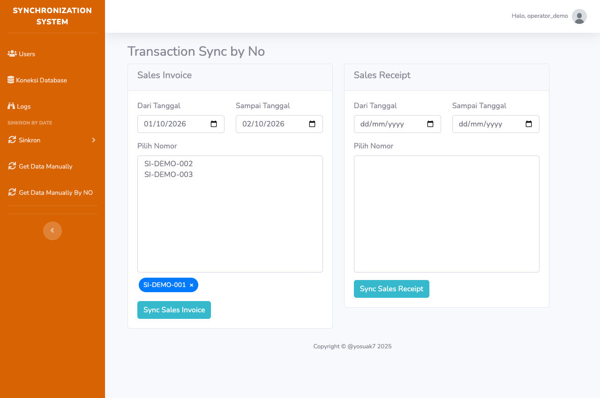

1. Buka Sinkron > Transaction Sync By No.
2. Pilih panel Sales Invoice atau Sales Receipt. Isi tanggal awal dan akhir pada panel tersebut.
3. Pilih satu atau beberapa nomor hingga chip pilihan muncul; hapus pilihan keliru dengan tanda x.
4. Klik Sync Sales Invoice atau Sync Sales Receipt.
5. Tunggu ringkasan, lalu periksa Logs serta dokumen yang bersangkutan di Accurate.

> Nomor invoice pada panel Sales Invoice dimuat dari sumber, tetapi pengiriman memakai detail yang sudah ada di aplikasi. Jika "Data transaksi tidak ditemukan", lakukan Get Data By NO terlebih dahulu.

Panel Sales Receipt menyajikan nomor invoice lokal sebagai acuan pembayaran. Sinkronkan invoice lebih dahulu, lalu penerimaannya. Fitur by nomor tidak menampilkan panel pembelian atau retur pada versi ini.

## Alur kerja pembelian

Urutan berikut membantu memastikan dokumen acuan tersedia sebelum transaksi turunannya diproses. Gunakan hanya jenis transaksi yang dipakai oleh perusahaan.

| Urutan | Get Data Manually | Sync By Date |
| --- | --- | --- |
| 1 | Get Purchase Order | Sync PO |
| 2 | Get Receive Item | Sync Receive Item |
| 3 | Get Purchase Invoice | Sync Purchase Invoice |
| 4 | Get Purchase Return | Sync Purchase Return |

### Contoh pekerjaan satu hari

1. Pastikan database Accurate tujuan benar dan data pemasok, barang, satuan, gudang, dan cabang sesuai sumber.
2. Ambil Purchase Order untuk 1 Oktober 2026 sampai 1 Oktober 2026. Periksa jumlah hasil.
3. Sinkronkan PO pada periode yang sama. Cocokkan nomor, pemasok, barang, kuantitas, dan nilai di Accurate.
4. Ambil lalu sinkronkan Receive Item. Jika dokumen memakai acuan PO, pastikan PO terkait tersedia.
5. Lanjutkan faktur pembelian. Periksa hubungan dengan penerimaan barang, harga, diskon, dan pajak.
6. Ambil lalu sinkronkan retur pembelian bila ada. Periksa dokumen acuan dan kuantitas retur.

> Jika dokumen acuan berasal dari hari lain, periode satu hari mungkin belum mencakup data yang dibutuhkan. Ambil dan sinkronkan dokumen acuannya dahulu.

Jika satu tahap gagal, perbaiki transaksi terkait dan periksa kembali hasilnya sebelum melanjutkan transaksi turunan. Jangan menganggap seluruh rantai sudah benar hanya karena dialog satu jenis transaksi berhasil.

## Alur kerja penjualan dan pembayaran

Untuk penjualan, bedakan invoice, pembayaran, dan retur. Satu invoice dapat menghasilkan beberapa penerimaan jika mempunyai beberapa pembayaran.

| Tahap | Pilihan berdasarkan tanggal | Pilihan berdasarkan nomor |
| --- | --- | --- |
| Invoice | Get Sales Invoice > Sync Sales Invoice | Get Data By NO > Sync Sales Invoice |
| Pembayaran | Get Sales Receipt > Sync Sales Receipt | Get Data By NO > Sync Sales Receipt |
| Retur | Get Sales Return > Sync Sales Return | Gunakan alur berdasarkan tanggal. |

1. Periksa pelanggan, barang, satuan, cabang, gudang, bank, harga, diskon, dan pajak yang relevan.
2. Ambil data invoice dan pembayaran dari sumber untuk periode atau nomor yang dipilih.
3. Sinkronkan Sales Invoice terlebih dahulu. Pastikan invoice tersedia di Accurate dengan nomor dan pelanggan yang benar.
4. Sinkronkan Sales Receipt. Cocokkan invoice yang dilunasi, bank, tanggal, dan nominal pembayaran.
5. Sinkronkan Sales Return bila ada. Periksa barang dan nilai retur terhadap dokumen terkait.

### Mengenali nomor penerimaan

Aplikasi membentuk nomor penerimaan dengan awalan SR- dan nomor/urutan pembayaran. Cari nomor tersebut di Logs serta Accurate; nomor penerimaan tidak selalu identik dengan nomor invoice.

> Saat mengulang sinkronisasi pembayaran, aplikasi dapat menghapus penerimaan lama yang cocok lalu membuat ulang. Periksa perubahan saldo dan hubungan pelunasan setelah proses selesai.

## Logs: membaca hasil pengiriman

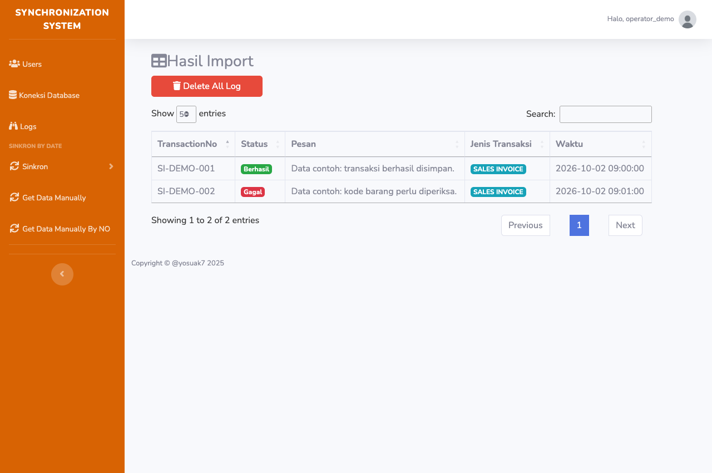

| Kolom | Cara membaca |
| --- | --- |
| TransactionNo | Nomor dokumen yang diproses; penerimaan dapat berawalan SR-. |
| Status | Gagal ditandai merah; keberhasilan ditampilkan hijau. |
| Pesan | Penjelasan hasil atau alasan gagal yang perlu diperiksa. |
| Jenis Transaksi | Jenis dokumen untuk membantu pencarian di Accurate. |
| Waktu | Waktu pencatatan hasil proses. |

Log ditampilkan untuk pengguna yang sedang login. Cari nomor transaksi melalui kolom Search bila tersedia, ubah jumlah baris tampil, atau gunakan halaman berikutnya pada tabel.

> Delete All Log menghapus log milik pengguna saat ini setelah konfirmasi. Ini tidak menghapus transaksi Accurate dan tidak membatalkan sinkronisasi. Simpan bukti yang diperlukan sebelum menghapus log.

## Menangani hasil sebagian gagal

Proses dapat berakhir dengan sebagian transaksi berhasil dan sebagian gagal. Ringkasan selesai bukan jaminan semua data benar. Gunakan catatan per nomor untuk membatasi pekerjaan ulang.

1. Catat jenis transaksi, periode, jumlah hasil, pesan dialog, username, dan database tujuan.
2. Buka Logs; temukan nomor berstatus Gagal dan baca pesan lengkapnya. Jika tidak ada log, simpan pesan dialog untuk pengelola.
3. Periksa keberadaan dokumen di Accurate. Respons jaringan yang gagal tidak selalu cukup untuk memastikan dokumen belum tersimpan.
4. Perbaiki penyebab: koneksi/sesi, kode master, tanggal, dokumen acuan, nominal, atau aturan database tujuan.
5. Jika data sumber berubah, ambil ulang data terkait agar database aplikasi diperbarui.
6. Ulangi nomor yang diperlukan menggunakan Sync By No untuk invoice/penerimaan; untuk jenis lain, persempit periode Sync By Date.
7. Periksa kembali log terbaru dan dokumen Accurate. Cocokkan jumlah detail, nilai, pajak, dan pembayaran.

> Beberapa alur menghapus dokumen Accurate lama sebelum menyimpan ulang. Jika penyimpanan berikutnya gagal, dokumen yang dihapus mungkin belum terbentuk kembali. Periksa langsung di Accurate sebelum menyatakan pekerjaan selesai.

### Saat perlu bantuan pengelola

Kirim nomor transaksi, jenis, rentang tanggal, waktu kejadian, database tujuan, pesan kesalahan, dan langkah yang sudah dilakukan. Sertakan screenshot yang sudah disamarkan. Jangan menyertakan password, Client Secret, atau token akses.

## Users: daftar dan penghapusan akun

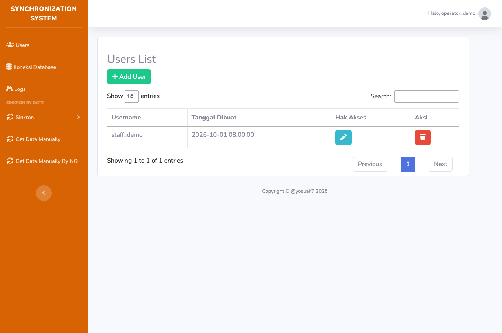

Menu Users menampilkan pengguna lain dengan kolom Username, Tanggal Dibuat, Hak Akses, dan Aksi. Add User membuka formulir penambahan akun.

### Menghapus pengguna

1. Temukan username yang tepat pada tabel.
2. Klik ikon tempat sampah pada kolom Aksi.
3. Baca username pada dialog konfirmasi. Pilih batal jika ragu; konfirmasikan hanya untuk akun yang memang akan dihapus.
4. Periksa pesan hasil dan daftar pengguna yang diperbarui.

> Tombol pena pada kolom Hak Akses mengarah ke rute yang belum didaftarkan dalam versi ini. Pengaturan peran/hak akses melalui tombol tersebut belum dapat dipakai. Hubungi pengelola untuk kebutuhan pembatasan akses.

## Menambahkan pengguna

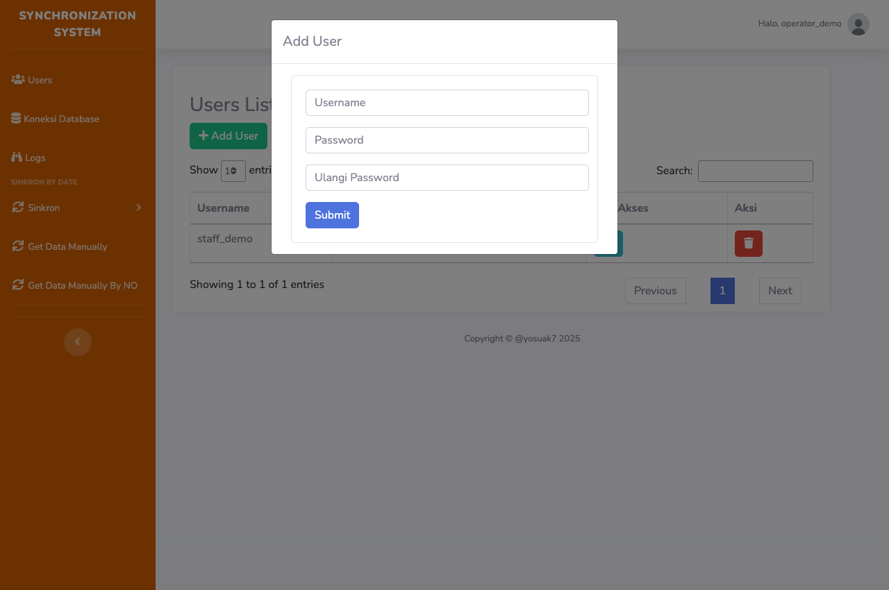

1. Buka Users, lalu klik Add User.
2. Isi username baru yang belum dipakai.
3. Isi Password dan Ulangi Password dengan nilai yang sama.
4. Klik Submit. Periksa pesan berhasil atau pemberitahuan akun sudah terdaftar.
5. Minta pemilik akun baru login. Pengaturan integrasi pengguna baru perlu diisi melalui Settings sesuai konfigurasi perusahaan.

Form pendaftaran juga tersedia pada alamat /login/register dengan tombol Register dan Halaman Utama. Cara yang biasa digunakan dari aplikasi adalah Add User.

> Akun baru dibuat aktif. Form ini tidak mempunyai pemilihan peran atau pembatasan menu. Gunakan password kuat dan serahkan kredensial hanya kepada pemilik akun.

## Profile: password dan avatar

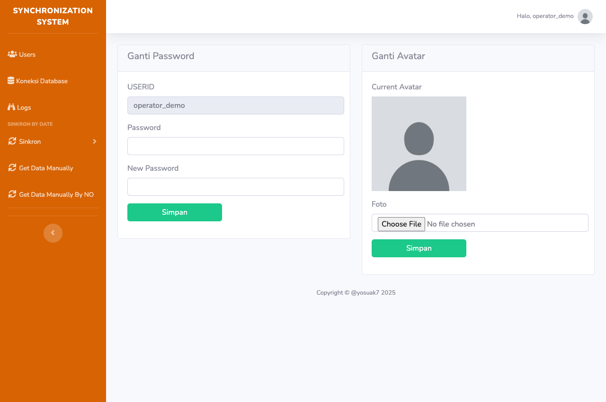

### Mengganti password

1. Buka menu akun > Profile. Pastikan USERID benar.
2. Pada panel Ganti Password, isi Password dan New Password dengan password baru yang sama.
3. Klik Simpan pada panel password; setelah berhasil, logout lalu login dengan password baru.

> Walaupun labelnya "Password" dan "New Password", pemeriksaan pada form menyamakan kedua nilai. Kolom pertama berfungsi sebagai pasangan konfirmasi password baru, bukan verifikasi password lama.

### Mengganti avatar

Pada panel Ganti Avatar, lihat Current Avatar, pilih file gambar melalui kolom Foto, lalu klik Simpan di panel avatar. Gunakan gambar JPG/PNG berukuran wajar. Batas format/ukuran tidak dinyatakan pada form; jika gagal, minta pengelola memeriksa unggahan.

## Master data: pelanggan dan barang

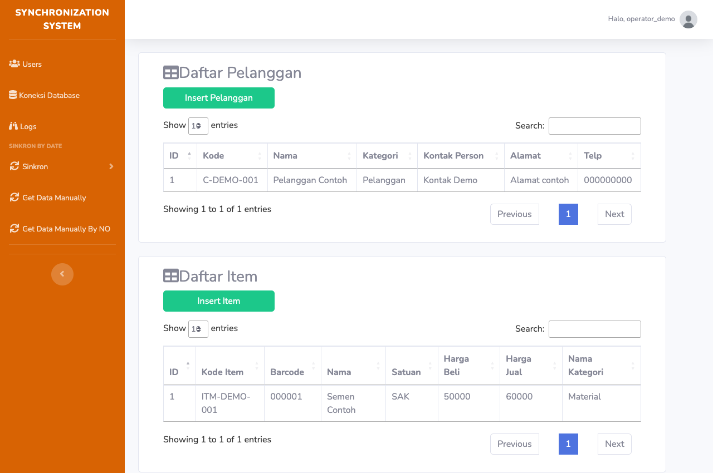

Halaman ini tersedia di /MasterData, tetapi tidak ditautkan pada sidebar saat ini. Buka melalui alamat aplikasi diikuti path tersebut setelah login dan koneksi Accurate tersedia.

1. Periksa tabel Daftar Pelanggan: kode, nama, kategori, kontak, alamat, dan telepon.
2. Klik Insert Pelanggan untuk menjalankan pengiriman data pelanggan yang dimuat.
3. Periksa Daftar Item: kode, barcode, nama, satuan, harga beli/jual, dan kategori.
4. Klik Insert Item, tunggu hasil dan baca log bila ada kegagalan.

> Tombol mengirim kumpulan data yang dimuat pada halaman, bukan hanya baris yang terlihat setelah pencarian/paginasi. Halaman mengambil sampai 1.000 data pelanggan, pemasok, dan barang; panel yang tampil di sini hanya pelanggan dan barang.

Untuk data yang lebih banyak, minta pengelola memeriksa cakupan proses. Tabel yang tampil tidak membuktikan seluruh master sumber sudah diambil.

## Master Sync: pelanggan, pemasok, barang

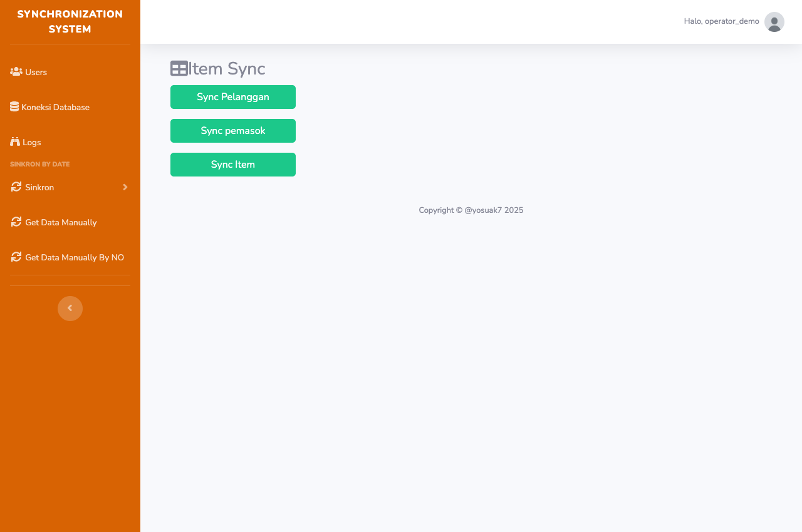

Halaman /SyncMasterItem belum ditautkan di sidebar. Pastikan login dan database Accurate sudah terhubung sebelum membuka alamat ini.

1. Klik Sync Pelanggan untuk master pelanggan.
2. Klik Sync pemasok untuk master pemasok.
3. Klik Sync Item untuk master barang.
4. Periksa dialog hasil dan Logs. Cocokkan kode master di Accurate sebelum memproses transaksi.

> Halaman mengambil sampai 200 data per jenis dari sumber. Tidak ada pilihan baris atau rentang di layar ini. Master karyawan tidak mempunyai tombol maupun rute sinkronisasi aktif pada versi yang didokumentasikan.

Halaman juga memiliki timer yang mencoba menjalankan tiga form berurutan setiap 15 menit selama halaman terbuka. Tutup halaman setelah pekerjaan selesai bila pengulangan tidak diperlukan. Timer dinonaktifkan hanya pada preview dokumentasi.

## Proses otomatis dan pekerjaan harian

### Yang perlu diketahui operator

Aplikasi menyediakan endpoint cron untuk mengambil data sumber ke database lokal. Kode proses tersebut memakai tanggal kemarin dalam zona Asia/Jakarta. Pesan "Sync berhasil dijalankan" pada endpoint ini bukan bukti data telah terkirim ke Accurate.

| Proses otomatis | Data yang diambil |
| --- | --- |
| Penerimaan barang | Receive Item |
| Pesanan pembelian | Purchase Order |
| Faktur pembelian | Purchase Invoice |
| Retur pembelian | Purchase Return |
| Faktur penjualan | Sales Invoice dan data pembayaran |
| Retur penjualan | Sales Return |

Halaman pengguna tidak menyediakan tombol untuk mengatur jadwal cron. Pengelola server menentukan jadwal dan memeriksa hasilnya. Kode mengambil hingga 1.000 baris per permintaan; operator tetap perlu memeriksa apakah seluruh data hari tersebut tercakup.

### Rutinitas yang disarankan

1. Pastikan pengambilan data otomatis atau manual sudah berjalan untuk periode kerja.
2. Hubungkan ulang database Accurate bila sesi berakhir.
3. Sinkronkan transaksi sesuai urutan bisnis.
4. Periksa Logs dan cocokkan hasil di Accurate.
5. Catat transaksi gagal, perbaiki penyebabnya, dan ulangi cakupan yang diperlukan.
6. Logout setelah pekerjaan selesai.

> Jangan mengandalkan halaman terbuka sebagai jadwal server. Timer master pada halaman SyncMasterItem dan proses cron merupakan mekanisme yang berbeda.

## Pemecahan masalah: akses dan koneksi

| Gejala | Yang dilakukan pengguna |
| --- | --- |
| Tidak dapat login | Periksa username/password; minta pengelola memastikan akun aktif. Jika lupa password, hubungi pengelola. |
| Session Expired / Anda Harus Login | Login ulang. Untuk transaksi dan log, hubungkan kembali Accurate dan pilih database. |
| Mohon Periksa ClientID / ClientID tidak ditemukan | Buka Settings. Pastikan integrasi benar; simpan, logout, lalu login kembali. |
| OAuth gagal / tidak kembali ke aplikasi | Catat pesan pada layar. Minta pengelola memeriksa ClientID dan kesamaan URL callback aplikasi dengan konfigurasi integrasi. |
| Daftar database tidak muncul | Pastikan akun Accurate mempunyai akses database tujuan. Hubungkan ulang; kirim pesan error kepada pengelola bila tetap gagal. |
| Pilih Database Terlebih Dahulu | Buka Koneksi Database, pilih database, klik Proses. |
| Gagal Tersambung KeDatabase | Periksa pilihan database dan akses akun. Coba otorisasi ulang setelah memastikan kredensial benar. |
| CSS, logo, atau halaman tidak lengkap | Muat ulang. Bila tetap bermasalah, minta pengelola memeriksa URL aplikasi dan akses aset. |
| Ikon Hak Akses membuka 404 | Rute pengaturan hak akses belum tersedia pada versi ini; hubungi pengelola. |

> Lakukan koneksi ulang setelah penyebabnya diperiksa. Jika error tetap sama, simpan pesan lengkap; jangan mengulang proses transaksi yang sedang berjalan.

## Pemecahan masalah: transaksi dan hasil

| Gejala | Tindakan berikutnya |
| --- | --- |
| Tanggal kosong | Isi kedua batas tanggal pada panel yang digunakan. Pastikan awal tidak melebihi akhir. |
| Daftar nomor kosong | Periksa periode. Get Data By NO mencari invoice di sumber; panel penerimaan by nomor mencari acuan dari data invoice lokal. |
| Tidak ada transaksi / hasil 0 | Periksa periode dan data sumber. Lakukan Get Data sebelum Sync; hasil 0 belum memastikan koneksi sumber sehat. |
| Data transaksi tidak ditemukan | Ambil ulang nomor/periode melalui Get Data. Nomor pada daftar sumber bisa belum mempunyai detail lokal. |
| Token atau session tidak ditemukan | Otorisasi Accurate ulang, pilih database, lalu periksa keberadaan transaksi tujuan sebelum mencoba lagi. |
| Kode pelanggan/barang/bank/gudang salah | Cocokkan kode sumber dengan master Accurate. Minta pengelola memeriksa pemetaan dan master yang diperlukan. |
| Dokumen acuan tidak ditemukan | Periksa invoice, PO, atau penerimaan acuannya. Sinkronkan acuan terlebih dahulu. |
| Error / HTTP / respons server tidak valid | Simpan pesan, waktu, nomor dan jenis. Periksa hasil di Accurate lalu minta pengelola memeriksa server/koneksi. |
| Progres tampak berhenti | Jangan klik ulang. Catat progres terakhir dan periksa koneksi; minta pengelola menentukan status proses sebelum mengulang. |
| Berhasil tetapi angka tidak cocok | Cocokkan detail barang, total, pajak, bank, dan pembayaran langsung di Accurate; ringkasan saja tidak cukup. |

Jika perbaikan melibatkan perubahan data sumber, ambil ulang data terlebih dahulu. Untuk invoice dan pembayaran gunakan by nomor; transaksi lain diperiksa melalui periode yang sempit.

## Pertanyaan yang sering muncul

### Apakah Get Data otomatis mengirim ke Accurate?

Tidak. Get Data menyimpan data di aplikasi. Gunakan Sync untuk mengirim transaksi ke Accurate, lalu periksa hasilnya.

### Mengapa label Due Date dipakai untuk rentang?

Pada halaman Sync By Date, kode menggunakannya sebagai akhir filter tanggal transaksi. Kolom tersebut tidak mengatur jatuh tempo dokumen tujuan.

### Bisakah memilih beberapa nomor sekaligus?

Ya, pada halaman berdasarkan nomor. Pilih nomor hingga muncul sebagai chip. Klik x untuk menghapus pilihan sebelum mengirim.

### Apakah semua transaksi mendukung by nomor?

Panel aktif Sync By No hanya Sales Invoice dan Sales Receipt. Get Data By NO menampilkan Sales Invoice & Receipt. Pembelian serta retur memakai halaman berdasarkan tanggal.

### Mengapa log berbeda antar pengguna?

Halaman Logs memfilter berdasarkan pengguna yang login. Proses yang dijalankan pengguna lain tidak otomatis muncul pada daftar Anda.

### Apakah Delete All Log membatalkan transaksi?

Tidak. Tombol tersebut menghapus riwayat log pengguna saat ini, bukan dokumen yang sudah tersimpan di Accurate.

### Apakah ada ekspor Excel atau dashboard laporan?

Tidak ditemukan tombol ekspor atau dashboard laporan aktif pada halaman pengguna versi ini. Dependency spreadsheet tersedia di proyek, tetapi bukan fitur ekspor yang dapat diikuti melalui menu saat ini.

### Apakah ulang Sync selalu hanya melewati duplikat?

Tidak. Sejumlah alur mencari dokumen yang sudah ada lalu menghapus dan membuat ulang. Periksa dampaknya sebelum menjalankan ulang periode yang sama.

## Istilah dan pemeriksaan data

| Istilah | Arti di aplikasi |
| --- | --- |
| Master data | Referensi pelanggan, pemasok, dan barang yang digunakan transaksi. |
| Get Data | Pengambilan sumber ke database aplikasi. |
| Sync | Pengiriman dari data aplikasi ke Accurate. |
| Purchase Order / PO | Pesanan pembelian. |
| Receive Item | Penerimaan barang. |
| Purchase Invoice / Return | Faktur / retur pembelian. |
| Sales Invoice / Receipt / Return | Faktur / penerimaan / retur penjualan. |
| Chip | Label nomor yang sudah dipilih, dengan tanda x untuk membatalkan. |
| Token / session Accurate | Informasi koneksi yang disimpan dalam sesi pengguna. |
| Logs | Catatan hasil pengiriman transaksi untuk pengguna terkait. |
| Partial / sebagian gagal | Sebagian proses berhasil dan sebagian perlu ditindaklanjuti. |

### Yang diperiksa pada dokumen tujuan

- Identitas: database perusahaan, nomor transaksi, tanggal, pelanggan/pemasok, cabang, dan gudang.
- Detail: kode barang, satuan, kuantitas, harga, diskon, pajak, serta jumlah total.
- Hubungan: PO/penerimaan/invoice acuan dan transaksi turunannya.
- Pembayaran: nomor invoice yang dilunasi, bank, tanggal, dan nominal. Periksa tiap penerimaan jika pembayaran lebih dari satu.

## Checklist dan latihan penggunaan

### Sebelum proses

- Akun aktif dan database Accurate tujuan sudah benar.
- Data master dan dokumen acuan tersedia.
- Jenis transaksi dan rentang/nomor dipilih dengan benar.
- Get Data untuk cakupan tersebut sudah selesai.
- Transaksi yang pernah terkirim sudah diperiksa sebelum pengulangan.

### Sesudah proses

- Jumlah berhasil dan gagal sudah dicatat.
- Pesan kegagalan dan nomor terkait sudah disimpan.
- Dokumen tujuan telah dicocokkan di Accurate.
- Tidak ada proses atau timer halaman yang masih diperlukan.
- Pekerjaan yang tertunda sudah disampaikan kepada pengelola; sesi diakhiri dengan Logout.

### Latihan pada database uji

1. Gunakan satu invoice contoh yang disediakan pengelola. Hubungkan database uji.
2. Pada Get Data By NO, pilih periode invoice tersebut dan satu nomornya. Klik Get Data.
3. Pada Sync By No, pilih nomor sama di panel Sales Invoice, lalu jalankan sinkronisasi.
4. Periksa log dan dokumen invoice di database uji.
5. Jika tersedia pembayaran terkait, lanjutkan panel Sales Receipt dan cocokkan nilai pelunasan.

> Latihan sebaiknya dilakukan pada database uji. Nomor SI-DEMO-001 dan database pada gambar merupakan data demonstrasi dan tidak dapat dipakai sebagai data operasional.

## Referensi alamat halaman

Gunakan URL aplikasi dari pengelola, lalu tambahkan path di bawah. Halaman transaksi, log, dan master memerlukan login aktif serta koneksi Accurate. Contoh lokal: http://127.0.0.1:8080/home.

| Fungsi | Path | Akses biasa |
| --- | --- | --- |
| Login | / atau /login | Alamat awal aplikasi |
| Halaman utama | /home | Sesudah login |
| Pengaturan | /home/settings | Menu akun > Settings |
| Profil | /home/profile | Menu akun > Profile |
| Keluar | /home/logout | Menu akun > Logout |
| Database Accurate | /auth/db-list | Koneksi Database |
| Pengguna | /users | Users |
| Pendaftaran | /login/register | Alamat langsung |
| Ambil data periode | /get-data | Get Data Manually |
| Ambil data nomor | /get-data-no | Get Data Manually By NO |
| Sync periode | /SyncTransaction | Sinkron > By Date |
| Sync nomor | /Transaction-no | Sinkron > By No |
| Riwayat hasil | /home/log | Logs |
| Daftar master | /MasterData | Alamat langsung |
| Sinkronisasi master | /SyncMasterItem | Alamat langsung |

> Huruf besar/kecil pada path mengikuti rute aplikasi. Alamat master belum tersedia sebagai tautan sidebar. Jika akses ditolak atau diarahkan ke login/database, selesaikan persyaratan koneksinya dahulu.

Tidak ada tombol konfigurasi cron, pengaturan jadwal, ekspor, atau pengaturan hak akses yang dapat digunakan melalui rute halaman aktif yang didokumentasikan.

## Catatan versi dan cakupan verifikasi

### Dasar dokumentasi

Panduan ini disusun dari README.md, konfigurasi rute, controller Home/Login/Auth, model M_Admin, konfigurasi sesi, dan template halaman aplikasi pada workspace BangunanAbadi tanggal 2 Oktober 2026. Nama tombol, cakupan transaksi, dan catatan perilaku mengikuti implementasi tersebut.

### Verifikasi yang dilakukan

- Halaman login aplikasi lokal dibuka dan direkam di browser.
- Template halaman setelah login dirender menggunakan CodeIgniter dengan data demonstrasi pada preview terisolasi. Navigasi, modal Add User, serta pemilihan nomor contoh direkam.
- Pengambilan nomor pada preview memakai respons contoh. Pesan log berhasil/gagal juga dibuat sebagai contoh, bukan hasil transaksi asli.
- Dokumen PDF dirender menjadi gambar untuk memeriksa layout, keterbacaan screenshot, nomor halaman, dan pemisahan tabel.

### Batas verifikasi

Login memakai akun operasional, otorisasi eksternal Accurate, pengambilan API sumber, penulisan database operasional, dan pengiriman transaksi ke Accurate tidak dijalankan dalam pembuatan panduan ini. Deskripsi proses tersebut berdasarkan pembacaan kode, bukan pengujian end-to-end.

### Perilaku versi yang perlu diingat

- Profile menyamakan dua kolom password baru; bukan pemeriksaan password lama.
- Hak Akses belum mempunyai rute aktif; master karyawan dan ekspor tidak tersedia dalam alur menu aktif.
- MasterData memuat hingga 1.000 data per jenis; SyncMasterItem hingga 200 dan mempunyai timer 15 menit.
- Sinkronisasi ulang dapat menghapus dan membuat kembali dokumen Accurate; Get Data ulang dapat mengganti detail lokal.

Jika aplikasi diperbarui, pengelola perlu meninjau kembali panduan, screenshot, pemetaan transaksi, dan prosedur pengulangan. Versi dokumen: 1.0 | Bahasa: Indonesia | Tanggal: 2 Oktober 2026.
